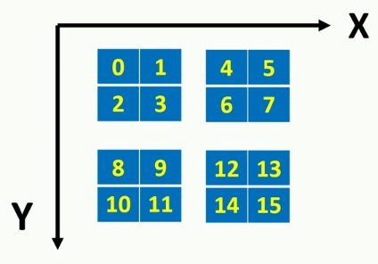

# CUDA

> You need an NVIDIA GPU but there is a way to run CUDA code without an NVIDIA GPU.
> 
> I used Visual Studio 2015 and CUDA Toolkit 9.1. Visual Studio 2015 does not support C++ by default. You have to go to File\New\Project\Visual C++ and click on "Install Visual C++ 2015 Tools for Windows Desktop".  
> 
> Visual Studio 2019 and CUDA Toolking 10.1 also work.

## Courses and tutorials

#### Youtube

[CUDA Tutorials](https://www.youtube.com/playlist?list=PLKK11Ligqititws0ZOoGk3SW-TZCar4dK)

#### Udacity (free)

https://developer.nvidia.com/udacity-cs344-intro-parallel-programming

You need an account to find this course: https://classroom.udacity.com/courses/cs344

#### Udemy (paid)

https://www.udemy.com/cuda-programming-masterclass/


---


CUDA program has:

- Host code (main function) (runs on CPU)
- Device code (runs on GPU)

`__global__` keyword means that function is going to be running on CUDA enabled device.

- GRID: collection of all threads running on one kernel
- BLOCK: threads in a grid are organized in groups called thread blocks

Example: 64 thread grid (4x4x4) has 8 thread blocks (each thread block has 4 threads)

```cpp
kernel_name <<<number_of_blocks,threads_per_block>>> (arguments);

dim3 variable_name(X, Y, Z) // initialized to 1 by default
variable_name.X;
```


CUDA runtime uniquely initialized `blockIdx` variable for each thread depending on the coordinates of the belonging thread block in the grid. It is dim3 type variable.


`blockDim` variable shows number of threads in each dimension of a thread block. All thread blocks in a grid have same block size, so this variable value is same for all the threads in a grid. blockDim is dim3 type variable.


`gridDim` variable consists number of thread blocks in each dimension of a grid. dim3 type variable

#### Example

```cpp
// 4 blocks which consist of 8x8 treads, in total 256 threads
int nx = 16, ny = 16;
dim3 block(8, 8);
dim3 grid(nx / block.x, ny/block.y);
```

### Hello World example

```cpp
__global__ void unique_idx_calc_threadIdx(int * input) {
  int tid = threadIdx.x;
  printf("threadIdx.x=%d value=%d\n", tid, input[tid]);
}
```

```cpp
int main(int argc, char * argv[]) {
  int array_size = 8;
  int h_data[] = {23, 9, 4, 53, 65, 12, 1, 33};

  int * d_data;
  // Allocate memory in each cuda core
  cudaMalloc((void**)&d_data, sizeof(int) * array_size);
  // Copy memory from the host device (CPU) to cuda device (GPU)
  cudaMemcpy(d_data, h_data, sizeof(int) * array_size, cudaMemcpyHostToDevice);

  // Single thread block with 8 threads
  dim3 block(8);
  dim3 grid(1);

  // Call a function, specify how many threads per block, send paramenters
  unique_idx_calc_threadIdx <<<grid, block>>> (d_data);
  cudaDeviceSynchronize();
  return 0;
}
```

### Unique index calculation

#### Using `threadIdx`, `blockIdx` and `blockDim`

```cpp
__global__ void unique_gid_calc(int * input) {
  int tid = threadIdx.x;
  int gid = tid + blockIdx.x * blockDim.x;
  printf("blockIdx.x=%d, threadIdx.x=%d, gid=%d, value=%d\n", blockIdx.x, tid, gid, input[gid]);
}
```

```cpp
int array_size = 16;
int h_data[] = { 23, 9, 4, 53, 65, 12, 1, 33, 87, 45, 23, 12, 342, 56, 44, 99};
...
dim3 block(4);
dim3 grid(4);
```

#### Index calculation for 2D array

```cpp
__global__ void unique_gid_calc_2d(int * input) {
  int gid = threadIdx.x;
  gid += gridDim.x * blockDim.x * blockIdx.y; // row offset
  gid += blockIdx.x * blockDim.x;             // block offset
  printf("blockIdx.x=%d, blockIdx.y=%d, threadIdx.x=%d, gid=%d, value=%d\n", blockIdx.x, blockIdx.y, threadIdx.x, gid, input[gid]);
}
```

#### Index calculation for 2D array of 2D



```cpp
  dim3 block(4);
  dim3 grid(2,2);
```

```cpp
__global__ void unique_gid_calc_2d(int * input) {
  int tid = threadIdx.x + blockDim.x * threadIdx.y;
  int row_offset = blockDim.x * blockDim.y * gridDim.x * blockIdx.y;
  int column_offset = blockDim.x * blockDim.y * blockIdx.x;

  int gid = tid + row_offset + column_offset;
  printf("blockIdx.x=%d, blockIdx.y=%d, threadIdx.x=%d, gid=%d, value=%d\n", blockIdx.x, blockIdx.y, threadIdx.x, gid, input[gid]);
}
```

### Transfer memory

```cpp
__global__ void mem_copy_test(int * input, int number_of_threads) {
  int gid = blockIdx.x * blockDim.x + threadIdx.x;
  if (gid < number_of_threads) {  // in case we have more threads than array has members
    printf("tid=%d, gid=%d, value=%d\n", threadIdx.x, gid, input[gid]);
  }
}
```

```c
int main(int argc, char * argv[]) {
  //int size = 150; // number of elements in the array
  int * h_input; //host variable
  h_input = (int*)malloc(150 * sizeof(int)); // since malloc returns void pointer, we have to explicitly cast it to the integer pointer 

  fill_array(h_input, 150);  //add values
  print_array(h_input, 150);

  int * d_input; // This array will be used in CUDA devices
  cudaMalloc((void**)&d_input, 150 * sizeof(int));  
  cudaMemcpy(d_input, h_input, 150 * sizeof(int), cudaMemcpyHostToDevice);

  dim3 block(64); // notice that we have 256 threads, but array has only 150 members
  dim3 grid(4);

  mem_copy_test << <grid, block >> > (d_input, 150);
  cudaDeviceSynchronize();
  cudaFree(d_input);
  free(h_input);
  cudaDeviceReset();
  return 0;
}
```

### Grid 3x2x2


```cpp
__global__ void tmp(int * input) {
  const int BLOCK_SIDE_SIZE = blockDim.x * blockDim.y;
  const int BLOCK_SIZE = BLOCK_SIDE_SIZE * blockDim.z;
  const int GRID_WALL_SIZE = BLOCK_SIZE * gridDim.x * gridDim.y;
  int tid = threadIdx.x + threadIdx.y * blockDim.x + BLOCK_SIDE_SIZE * threadIdx.z;
  int row_offset = BLOCK_SIZE * gridDim.x * blockIdx.y;
  int column_offset = BLOCK_SIZE * blockIdx.x;
  int z_value = GRID_WALL_SIZE * blockIdx.z;
  int gid = tid + row_offset + column_offset + z_value;
  printf("%d\t%d\t%d\t%d\t%d\t%d\t%d\t%d\n", threadIdx.x, threadIdx.y, threadIdx.z, blockIdx.x, blockIdx.y, blockIdx.z, tid, input[gid]);
  //[12]6]
  //[34]8]
}

int main(int argc, char * argv[]) {
  int number_of_elements = 96;
  int * h_data = (int*)malloc(number_of_elements * sizeof(int));
  fill_array(h_data, number_of_elements);

  int * d_data;
  cudaMalloc((void**)&d_data, number_of_elements * sizeof(int));
  cudaMemcpy(d_data, h_data, number_of_elements * sizeof(int), cudaMemcpyHostToDevice);

  dim3 grid(3, 2, 2); // grid of thread blocks
  dim3 block(2, 2, 2);

  printf("tIdx.x\ttIdx.y\tIdx.z\tbId.x\tbId.y\tbId.z\ttid\tvalue\n");
  tmp << < grid, block >> > (d_data);
  cudaDeviceSynchronize();
  free(h_data);
  cudaFree(d_data);
  cudaDeviceReset();
  return 0;
}
```

## Add two arrays

```cpp
__global__ void sum_two_arrays(int * a, int * b, int * c, int size) {
  int gid = blockIdx.x * blockDim.x + threadIdx.x;
  if (gid < size) {
    c[gid] = a[gid] + b[gid];
  }
}
```

Validity check: compare if the same result is achieved using both CPU and GPU

```cpp
void sum_two_arrays_cpu(int * a, int * b, int * c, int size) {
  for (int i = 0; i < size; i++) {
    c[i] = a[i] + b[i];
  }
}

void compare_arrays(int *a, int *b, int size) {
  for (int i = 0; i < size; i++) {
    if (a[i] != b[i]) {
      printf("Arrays are different!\n");
      printf("%d!=%d", a[i], b[i]);
      return;
    }
  }
  printf("Congratulations, arrays are the same.\n");
}
```

```cpp
int main(int argc, char * argv[]) {
  int number_of_elements = 10000;
  const int BYTE_SIZE = number_of_elements * sizeof(int);
  const int block_size = 128; // [0..127][128..255][256..5122]...[9984..10112]
  int * h_a, *h_b, *h_result, *tmp;
  h_a = (int*)malloc(BYTE_SIZE);
  h_b = (int*)malloc(BYTE_SIZE);
  h_result = (int*)malloc(BYTE_SIZE);
  tmp = (int*)malloc(BYTE_SIZE);

  fill_array(h_a, number_of_elements);
  fill_array(h_b, number_of_elements);

  int *d_a, *d_b, *d_result;
  cudaMalloc((int**)&d_a, BYTE_SIZE);
  cudaMalloc((int**)&d_b, BYTE_SIZE);
  cudaMalloc((int**)&d_result, BYTE_SIZE);

  cudaMemcpy(d_a, h_a, BYTE_SIZE, cudaMemcpyHostToDevice);
  cudaMemcpy(d_b, h_b, BYTE_SIZE, cudaMemcpyHostToDevice);

  dim3 block(block_size);
  dim3 grid((number_of_elements / block.x) + 1);
  sum_two_arrays << < grid, block >> > (d_a, d_b, d_result, number_of_elements);

  cudaDeviceSynchronize(); // block host execution; wait until kernel finishes
  cudaMemcpy(tmp, d_result, BYTE_SIZE, cudaMemcpyDeviceToHost);
  cudaDeviceSynchronize();

  sum_two_arrays_cpu(h_a, h_b, h_result, number_of_elements);
  compare_arrays(h_result, tmp, number_of_elements); //Validity check

  cudaFree(d_a);
  cudaFree(d_b);
  cudaFree(d_result);
  free(h_a);
  free(h_b);
  free(h_result);
  cudaDeviceReset();
  return 0;
}
```

## Error handling

```cpp
cudaError error;
error = cudaMalloc((int**)&d_a, BYTE_SIZE);
if (error != cudaSuccess) {
  fprintf(stderr, "Error : %s\n", cudaGetErrorString(error));
}
```

## Benchmarking

```cpp
#include <ctime>
...
clock_t gpu_start = clock();
sum_two_arrays << < grid, block >> > (d_a, d_b, d_result, number_of_elements);
clock_t gpu_end = clock();
printf("GPU time: %4.6f\n", (double)((double)(gpu_end - gpu_start) / CLOCKS_PER_SEC));
```

# Info

```cpp
cudaMemcpy (void * destination, const void * source, size_t count, enum cudaMemcpyKind kind)   
```

We only use here `cudaMemcpyDeviceToHost` and `cudaMemcpyHostToDevice` for `kind`.

`__shared__` Shared memory is on chip memory which is partitioned amongst thread blocks. It shares life time with the thread block. 

# Examples

## 1. Square elements of the array

Make an array of variable size. Fill it with data. Square each element using CUDA.

```cpp
#define numberOfThreads 256

__global__ void square(int * a) {
  int id = threadIdx.x + blockIdx.x * blockDim.x;
  a[id] = a[id] * a[id];
}

int main(int argc, char * argv[]) {
  int * cpu_array;
  int * gpu_array;
  int number_of_elements;
  printf("Enter number of element: ");
  scanf("%d", &number_of_elements);
  cpu_array = (int*)malloc(number_of_elements * sizeof(int));
  fill_array(cpu_array, number_of_elements, "2*i");
  print_array(cpu_array, number_of_elements);

  int byte_size = number_of_elements * sizeof(int);
  cudaMalloc((void**)&gpu_array, byte_size);
  cudaMemcpy(gpu_array, cpu_array, byte_size, cudaMemcpyHostToDevice);

  int grid_dimension = (number_of_elements / numberOfThreads + 1); // to ensure at least one thread
  int threads_per_block = numberOfThreads;
  square << <grid_dimension, threads_per_block >> > (gpu_array);

  cudaMemcpy(cpu_array, gpu_array, byte_size, cudaMemcpyDeviceToHost);
  print_array(cpu_array, number_of_elements);

  cudaFree(gpu_array);
  free(cpu_array);

  return 0;
}
```

## 2. Find min. and max. element of a whole matrix using shared memory and thread reduction

Since in this solution we use one block, we can't use more than `1024 threads`. 
For example, if our matrix has `1024 elements`, and we use single block with `256 threads`, each thread will get `4 elements`.

| thread |     |     |     |     |
| ------ | --- | --- | --- | --- |
| 0.     | 5   | 7   | 9   | 1   |
| 1.     | 2   | 8   | 4   | 3   |
| 2.     | 9   | 7   | 5   | 1   |
| 3.     | 0   | 6   | 3   | 2   |
| ...    |     |     |     |     |
| 255.   | .   | .   | .   | .   |

First, each thread finds the maximum and minimum element of the array it got.

```
// These two arrays live in shared memory. We are using one block of, for example, 256 threads so threads can share the array.
min[] = {1,1,0,...}
max[] = {9,8,9,6...}
```

Next, we divide the number of threads by two, so now we work with `128` threads.
Each thread will compare `i-th` element of the first half from (0th until 127th element) of the `min` array with `i-th` element of the second half (128th untill 255th element) of the `min` array. Value of the smaller element will be stored in the first half of the `min` array. Do the same for `max` array.

Another example if array has 4 elements: In the end we basically have `min[]={0} max[]={9}` because `0-th` index hold the value.

| step | arrays                            |
| ---- | --------------------------------- |
| 0    | `min[]={5,2,9,0} max[]={5,2,9,0}` |
| 1    | `min[]={5,0,9,0} max[]={9,2,9,0}` |
| 2    | `min[]={0,0,9,0} max[]={9,2,9,0}` |

Solution:

```cpp
#include "cuda_runtime.h"
#include "device_launch_parameters.h"
#include "cuda.h"
#include <cuda_runtime_api.h>
#include <device_functions.h>
#include <stdio.h>
#include <stdlib.h>
#include "utilities.h"
#define number_of_threads 256
```

```cpp
__global__ void findMinMax(int * matrix, int * min, int * max, int size) {
    int idx = threadIdx.x;            // Since we use one block.
  __shared__ int s_max[number_of_threads];  // There two arrays are in the shared memory.
  __shared__ int s_min[number_of_threads];
  int slice = size / number_of_threads ;    // Number of elements in each thread. Eg: slice=1030/256=4

  int start = slice * idx;          // start = 0, 4, 8...1020
  if (idx == number_of_threads - 1) {      // If this is the last thread, its slice will be a little bit bigger. Eg: 10
    slice = slice + size % number_of_threads;
  }
  int end = start + slice;          // end = 4, 8, 12...1030
  printf("Thread %d, start=%d, end=%d, slice=%d\n", idx, start, end, slice);
  int local_min = matrix[start];
  int local_max = matrix[start];
  for (int i = start; i < end; i++) {
    if (matrix[i] < local_min) {
      local_min = matrix[i];
    }
    if (matrix[i] > local_max) {
      local_max = matrix[i];
    }
  }
  s_max[idx] = local_max;  // store local minimum and maximum in the shared memory
  s_min[idx] = local_min;
  __syncthreads(); // We need to wait for every threads to finish its job till this point in the code.
  int half = number_of_threads;
  while(half != 0){ // Number of threads must be square of 2.
    __syncthreads();

    half >>= 1; // bit shift instead of division. Same as half = half / 2;
    if (idx < half) {
      if (s_min[idx] > s_min[idx + half]) {
        s_min[idx] = s_min[idx + half];
      }
      if (s_max[idx] < s_max[idx + half]) {
        s_max[idx] = s_max[idx + half];
      }
    }
  }
  if (idx == 0) {
    *min = s_min[0];
    *max = s_max[0];
  }
}
```

```cpp
int main(int argc, char * argv[]) {

  int * cpu_min = (int*)malloc(sizeof(int));
  int * cpu_max = (int*)malloc(sizeof(int));
  int *cpu_matrix, *gpu_matrix, *gpu_min, *gpu_max;
  int m = 32, n = 32;
  printf("Total elements=%d\n", m*n);
  cpu_matrix = (int*)malloc(m*n * sizeof(int));
  fill_array(cpu_matrix, m*n, "random", 10000);
  if (m < 5) print_matrix(cpu_matrix, m, n);

  cudaMalloc((void**)&gpu_matrix, m*n * sizeof(int));
  cudaMalloc((void**)&gpu_min, sizeof(int));
  cudaMalloc((void**)&gpu_max, sizeof(int));

  cudaMemcpy(gpu_matrix, cpu_matrix, m*n * sizeof(int), cudaMemcpyHostToDevice);

  findMinMax << <1, number_of_threads >> > (gpu_matrix, gpu_min, gpu_max, m*n);

  cudaMemcpy(cpu_min, gpu_min, sizeof(int), cudaMemcpyDeviceToHost);
  cudaMemcpy(cpu_max, gpu_max, sizeof(int), cudaMemcpyDeviceToHost);
  printf("GPU found:\nmin=%d max=%d\n", *cpu_min, *cpu_max);
  printf("CPU found:\nmin=%d max=%d", cpu_find_array(cpu_matrix, m*n, "min"), cpu_find_array(cpu_matrix, m*n, "max"));

  cudaFree(gpu_matrix);
  cudaFree(gpu_min);
  cudaFree(gpu_max);
  free(cpu_matrix);

  return 0;
}
```

## 3. Change signs of numbers in the array. Find out how many positive and negative members does the array have.

Same logic as for previous example with shared memory and thread reduction.

```cpp
__global__ void sign(int * a, int * number_of_positive, int * number_of_negative, int n) {
  int positive_counter = 0, idx = threadIdx.x;    // We use only one block.
  __shared__ int shared_positive_numbers[number_of_threads];    
  int slice = n / number_of_threads;
  int start = idx*slice;
  if (idx == number_of_threads - 1) {
    slice += n % number_of_threads;
  }
  int end = start + slice;
  for (int i = start; i < end; i++) {
    a[i] *= -1;
    if (a[i] >= 0) {
      positive_counter++;
    }
  }
  shared_positive_numbers[idx] = positive_counter;
  int half = number_of_threads;
  do {
    __syncthreads();
    half >>= 1;
    if (idx < half) {
      shared_positive_numbers[idx] += shared_positive_numbers[idx + half];
    }
  } while (half != 1);
  if (idx == 0) {
    *number_of_positive = shared_positive_numbers[0];
    *number_of_negative = n - shared_positive_numbers[0]; // Why not n-number_of_positive? Because positive_numbers is stored in shared GPU memory and it is much faster to access it.
  }
}
```

```cpp
int main(int argc, char * argv[]) {
  int n = 1024;
  int * cpu_number_of_positive = (int*)malloc(sizeof(int));
  int * cpu_number_of_negative = (int*)malloc(sizeof(int));
  int *cpu_array = (int*)malloc(n * sizeof(int)); 

  printf("Total elements=%d\n", n);
  fill_array(cpu_array, n, "random",10000);

  int *gpu_array, *gpu_number_of_positive, *gpu_number_of_negative;
  cudaMalloc((void**)&gpu_array, n * sizeof(int));
  cudaMalloc((void**)&gpu_number_of_positive, sizeof(int));
  cudaMalloc((void**)&gpu_number_of_negative, sizeof(int));
  cudaMemcpy(gpu_array, cpu_array, n * sizeof(int), cudaMemcpyHostToDevice);

  sign << <1, number_of_threads >> > (gpu_array, gpu_number_of_positive, gpu_number_of_negative, n);
  cudaMemcpy(cpu_number_of_negative, gpu_number_of_negative, sizeof(int), cudaMemcpyDeviceToHost);
  cudaMemcpy(cpu_number_of_positive, gpu_number_of_positive, sizeof(int), cudaMemcpyDeviceToHost);
  cudaMemcpy(cpu_array, gpu_array, n * sizeof(int), cudaMemcpyDeviceToHost);
  printf("GPU found %d positive numbers.\n", *cpu_number_of_positive);
  printf("CPU found %d positive numbers.\n", cpu_find_number_of_positive(cpu_array, n));

  cudaFree(gpu_array);
  cudaFree(gpu_number_of_negative);
  cudaFree(gpu_number_of_positive);
  free(cpu_array);
  free(cpu_number_of_negative);
  free(cpu_number_of_positive);

  return 0;
}
```

# Homework

## A*x + B

Write CUDA program which calculates following formula: `A*x + B`, where `A` and `B` are arrays and `x` is a number. Write code for validating results, comparing it with results done using sequential calculation on CPU. 

```cpp
__global__ void calc(int *a, int *b, int *x, int *result, int *number_of_elements) {
  //int idx = threadIdx.x; // 1 block; maximum 1024 elements/threads are allowed
  int idx = blockIdx.x * blockDim.x + threadIdx.x; // n blocks; maximum 1024 elements/threads per block
  if (idx < *number_of_elements) {
    result[idx] = a[idx] * (*x) + b[idx];
  }
}

int main(int argc, char * argv[]) {
  int *a, *b, *x, *result, *result_cpu;
  int *a_gpu, *b_gpu, *x_gpu, *result_gpu, *size_gpu;
  int number_of_elements;
  printf("Enter number of element: ");
  scanf("%d", &number_of_elements);
  a = (int*)malloc(number_of_elements * sizeof(int));
  b = (int*)malloc(number_of_elements * sizeof(int));
  x = (int*)malloc(sizeof(int));
  result = (int*)malloc(number_of_elements * sizeof(int));
  result_cpu = (int*)malloc(number_of_elements * sizeof(int));
  fill_array(a, number_of_elements, "2*i");
  fill_array(b, number_of_elements, "random", number_of_elements);
  *x = 3;
  //print_array(a, number_of_elements);
  //print_array(b, number_of_elements);

  cudaMalloc((void**)&a_gpu, number_of_elements * sizeof(int));
  cudaMalloc((void**)&b_gpu, number_of_elements * sizeof(int));
  cudaMalloc((void**)&result_gpu, number_of_elements * sizeof(int));
  cudaMalloc((void**)&x_gpu, sizeof(int));
  cudaMalloc((void**)&size_gpu, sizeof(int));
  cudaMemcpy(a_gpu, a, number_of_elements * sizeof(int), cudaMemcpyHostToDevice);
  cudaMemcpy(b_gpu, b, number_of_elements * sizeof(int), cudaMemcpyHostToDevice);
  cudaMemcpy(x_gpu, x, sizeof(int), cudaMemcpyHostToDevice);
  cudaMemcpy(size_gpu, &number_of_elements, sizeof(int), cudaMemcpyHostToDevice);

  dim3 block(1024, 1, 1);
  dim3 grid(number_of_elements / block.x + 1, 1, 1);
  calc << <grid, block>> > (a_gpu, b_gpu, x_gpu, result_gpu, size_gpu);

  cudaMemcpy(result, result_gpu, number_of_elements * sizeof(int), cudaMemcpyDeviceToHost);
  //print_array(result, number_of_elements);

  // Do the same calculation on CPU to test the results
  for (int i = 0; i < number_of_elements; i++) {
    result_cpu[i] = a[i] * (*x) + b[i];
  }
  compare_arrays(result, result_cpu, number_of_elements);

  cudaFree(result_gpu);
  cudaFree(a_gpu);
  cudaFree(b_gpu);
  free(a);
  free(b);
  free(x);
  free(result);
  cudaDeviceReset();

  return 0;
}
```

## Find occurrences of value *k* in matrix *A*

```cpp
__global__ void gpu_find_occurrences(int * a_gpu, int * n_gpu, int * k_gpu, int * occurrences_gpu) {
  __shared__ int occurrences_per_row[number_of_threads];
  int idx = blockIdx.x * blockDim.x + threadIdx.x;
  int occurrences = 0;
  int slice = *n_gpu / number_of_threads;
  int start = idx * slice;
  int end = start + slice;
  if (idx == number_of_threads - 1) {
    end += *n_gpu % number_of_threads;
  }
  for (int i = start; i < end; i++) {
    if (a_gpu[i] == *k_gpu) {
      occurrences++;
    }
  }
  //printf("idx=%d\n", threadIdx.x);
  occurrences_per_row[idx] = occurrences;
  __syncthreads();

  int half = number_of_threads;
  while (half != 0) {
    __syncthreads();
    half >>= 1;
    if (idx < half) {
      occurrences_per_row[idx] += occurrences_per_row[idx + half];
    }
  }
  if (idx == 0) {
    *occurrences_gpu = occurrences_per_row[0];
  }
}
```

```cpp
int cpu_find_occurrences(int * a, int n, int k) {
  int occurrences = 0;
  for (int i = 0; i < n; i++) {
    for (int j = 0; j < n; j++) {
      if (a[i*n + j] == k) {
        occurrences++;
      }
    }
  }
  return occurrences;
}
```

```cpp
int main() {
  const static int n = 16*1024;
  int *k = (int*)malloc(sizeof(int));
  int *a = (int*)malloc(n*n*sizeof(int));
  fill_array(a, n, "random", 15);
  *k = 10;

  int *a_gpu, *n_gpu, *k_gpu, *occurrences_gpu, gpu_occurrences;
  cudaMalloc((void**)&a_gpu, n * n * sizeof(int));
  cudaMalloc((void**)&k_gpu, sizeof(int));
  cudaMalloc((void**)&n_gpu, sizeof(int));
  cudaMalloc((void**)&occurrences_gpu, sizeof(int));

  cudaMemcpy(a_gpu, a, n*n * sizeof(int), cudaMemcpyHostToDevice);
  cudaMemcpy(k_gpu, k, sizeof(int), cudaMemcpyHostToDevice);
  cudaMemcpy(n_gpu, &n, sizeof(int), cudaMemcpyHostToDevice);

  gpu_find_occurrences << <(1,1,1),(number_of_threads) >> > (a_gpu, n_gpu, k_gpu, occurrences_gpu);

  cudaMemcpy(&gpu_occurrences, occurrences_gpu, sizeof(int), cudaMemcpyDeviceToHost);
  printf("GPU occurrences: %d\n", gpu_occurrences);

  int cpu_occurrences = cpu_find_occurrences(a, n, *k);
  printf("CPU occurrences: %d\n", cpu_occurrences);

  cudaFree(a_gpu);
  cudaFree(k_gpu);
  cudaFree(n_gpu);
  cudaFree(occurrences_gpu);
  free(a);
  free(k);
  cudaDeviceReset();

  return 0;
}
```

# Laboratory work

### 1. `B[i] = (3*A[i] + 10* A[i+1] + 7*A[i+2]) / 20.f`

```cpp
__global__ void gpu_calc(float * A, float * B, int * n) {
  int idx = threadIdx.x + blockIdx.x * blockDim.x;
  if (idx < *n) {
    B[idx] = (3 * A[idx] + 10 * A[idx + 1] + 7 * A[idx + 2]) / 20.f;
    //printf("idx=%d A[i]=%f A[i+1]=%f A[i+2]=%f B[i]=%f\n", idx, A[idx], A[idx + 1], A[idx + 2], B[idx]);
  }
}

void cpu_calc(float * A, float * B, int n) {
  for (int i = 0; i < n - 2; i++) {
    B[i] = (3*A[i] + 10 * A[i + 1] + 7 * A[i + 2]) / 20.f;
  }
}

int main() {
  int n;
  float *A, *B_cpu_result;
  printf("Enter A array size: ");
  //scanf("%d", &n);
  n = 1024 * 1024;
  A = (float*)malloc(n * sizeof(float));

  B_cpu_result = (float*)malloc(n * sizeof(float));
  fill_array(A, n, "random");
  //print_array(A, n);
  cpu_calc(A, B_cpu_result, n);
  //printf("B_cpu_result:\n");
  //print_array(B_cpu_result, n-2);

  clock_t gpu_start = clock();
  float *A_gpu, *B_gpu, *B_gpu_result;
  int *n_gpu;
  cudaMalloc((void**)&A_gpu, n * sizeof(float));
  cudaMemcpy(A_gpu, A, n * sizeof(float), cudaMemcpyHostToDevice);
  n = n - 2;
  cudaMalloc((void**)&B_gpu, n * sizeof(float));
  B_gpu_result = (float*)malloc(n * sizeof(float));
  cudaMalloc((void**)&n_gpu, sizeof(float));
  cudaMemcpy(n_gpu, &n,  sizeof(int), cudaMemcpyHostToDevice);

  dim3 block(number_of_threads);
  dim3 grid(n/number_of_threads + 1);
  //printf("block size: %d, %d, %d\n", block.x, block.y, block.z);
  //printf("grid size: %d, %d, %d\n", grid.x, grid.y, grid.z);

  gpu_calc << < grid, block >> > (A_gpu, B_gpu, n_gpu);
  clock_t gpu_end = clock();
  printf("GPU time: %4.6f\n", (double)((double)(gpu_end - gpu_start) / CLOCKS_PER_SEC));

  cudaMemcpy(B_gpu_result, B_gpu, n * sizeof(float), cudaMemcpyDeviceToHost);
  //printf("B_gpu_result:\n");
  //print_array(B_gpu_result, n - 2);

  compare_arrays(B_gpu_result, B_cpu_result, n);

  cudaFree(A_gpu);
  cudaFree(B_gpu);
  cudaFree(n_gpu);
  free(A);
  free(B_cpu_result);
  free(B_gpu_result);

  printf("end.");
  cudaDeviceReset();
  return 0;
}
```

### 2. Find minimum and maximum elements of all columns

This solution uses shared memory and one block, so the limit is 1024 columns.

```cpp
#define rows 2050
#define cols 1024  //can only be 1024 matrices per block, because we use shared memory and one block- two blocks have two separate shared memories
#define number_of_threads 1024

__global__ void gpu_calc(int * A, int * result_min, int * result_max) {
  __shared__ int min_per_cols_gpu[cols];
  __shared__ int max_per_cols_gpu[cols];
  int idx = threadIdx.x;
  if (idx < cols) {
    int local_col_min = A[idx];
    int local_col_max = A[idx];
    for (int i = 0; i < rows*cols; i = i + cols) {
      int index = idx + i;
      //printf("id=%d i=%d index=%d value=%d\n", idx, i, index, A[index]);
      if (local_col_max < A[index]) {
        local_col_max = A[index];
      }
      if (local_col_min > A[index]) {
        local_col_min = A[index];
      }
    }
    min_per_cols_gpu[idx] = local_col_min;
    max_per_cols_gpu[idx] = local_col_max;
    __syncthreads();
    if (idx == 0) {
      for (int i = 0; i < cols; i++) {
        result_min[i] = min_per_cols_gpu[i];
        result_max[i] = max_per_cols_gpu[i];
      }
    }
    if (blockIdx.x != 0) {
      printf("blockIdx.x=%d idx=%d %d %d %d \n", blockIdx.x, idx, A[idx + 0 * cols], A[idx + 1 * rows], A[idx + 2 * rows]);
    }
  }

}

void cpu_calc(int * A, int *min_per_cols_cpu, int *max_per_cols_cpu) {
  for (int j = 0; j < cols; j++) {
    int local_col_min = A[j];
    int local_col_max = A[j];
    for (int i = 0; i < rows; i++) {
      //printf("%d ", A[i*rows + j]);
      if (A[i*cols + j] < local_col_min) {
        local_col_min = A[i*cols + j];
      }
      if (A[i*cols + j] > local_col_max) {
        local_col_max = A[i*cols + j];
      }
    }
    min_per_cols_cpu[j] = local_col_min;
    max_per_cols_cpu[j] = local_col_max;
    //printf("\n");
  }
}

int main() {
  int i, j;
  int *A;
  A = (int*)malloc(rows * cols * sizeof(int));
  fill_array(A, rows * cols, "random", cols*rows);
  if (rows < 10) { 
    printf("Printing matrix:\n");
    print_matrix(A, rows, cols); 
    printf("Ok.\n");
  };

  int *min_per_cols_cpu = (int*)malloc(cols * sizeof(int));
  int *max_per_cols_cpu = (int*)malloc(cols * sizeof(int));

  cpu_calc(A, min_per_cols_cpu, max_per_cols_cpu);

  int *A_gpu, *min_per_cols_gpu, *max_per_cols_gpu, *result_min_gpu, *result_max_gpu;
  cudaMalloc((void**)&A_gpu, rows * cols * sizeof(int));
  cudaMalloc((void**)&min_per_cols_gpu, cols * sizeof(int));
  cudaMalloc((void**)&max_per_cols_gpu, cols * sizeof(int));
  cudaMemcpy(A_gpu, A, rows * cols * sizeof(int), cudaMemcpyHostToDevice);
  dim3 block(cols);
  dim3 grid(1);  // at least one block
  printf("rows=%d cols=%d\n", rows, cols);
  printf("block.x=%d block.y=%d block.z=%d\n", block.x, block.y, block.z);
  printf("grid.x=%d, grid.y=%d, grid.z=%d\n", grid.x, grid.y, grid.z);
  gpu_calc << < grid, block >> > (A_gpu, min_per_cols_gpu, max_per_cols_gpu);
  cudaDeviceSynchronize();

  result_min_gpu = (int*)malloc(cols * sizeof(int));
  result_max_gpu = (int*)malloc(cols * sizeof(int));
  cudaMemcpy(result_min_gpu, min_per_cols_gpu, cols * sizeof(int), cudaMemcpyDeviceToHost);
  cudaMemcpy(result_max_gpu, max_per_cols_gpu, cols * sizeof(int), cudaMemcpyDeviceToHost);

  if (rows < 10) {
    printf("\nCPU min:\n");
    print_array(min_per_cols_cpu, cols);
    printf("CPU max:\n");
    print_array(max_per_cols_cpu, cols);

    printf("\nGPU min:\n");
    print_array(result_min_gpu, cols);
    printf("GPU max:\n");
    print_array(result_max_gpu, cols);
  }
  else {
    compare_arrays(min_per_cols_cpu, result_min_gpu, cols);
    compare_arrays(max_per_cols_cpu, result_max_gpu, cols);
  }

  printf("end.");
  cudaDeviceReset();

  return 0;
}
```

### 6. Change each negative element of array A with the smallest positive number from that array.

```cpp
#include "cuda_runtime.h"
#include "device_launch_parameters.h"
#include "cuda.h"
#include <cuda_runtime_api.h>
#include <device_functions.h>
#include <stdio.h>
#include <stdlib.h>
#include "utilities.h"
#include <iostream>

#define number_of_threads 1024

__global__ void gpu_calc(int *A, int *n) {
  __shared__ int shared_min_per_slice[number_of_threads];
  int idx = threadIdx.x;
  int slice = (*n) / number_of_threads;
  int start = idx*slice;
  int end = start + slice;
  if (idx == number_of_threads - 1) {
    end += *n % number_of_threads;
  }
  int local_min = INT_MAX;

  for (int i = start; i < end; i++) {
    if (A[i]>0 && A[i] < local_min) {
      local_min = A[i];
    }
  }
  shared_min_per_slice[idx] = local_min;
  //printf("idx=%d, slice=%d, start=%d, end=%d, local_min=%d\n", idx, slice, start, end, local_min);
  __syncthreads();
  int half = number_of_threads;
  while (half != 0) {
    __syncthreads();
    half >>= 1;  // half = half / 2
    if (idx < half) {
      if (shared_min_per_slice[idx + half] < shared_min_per_slice[idx]) {
        shared_min_per_slice[idx] = shared_min_per_slice[idx + half];
      }
    }
  }
  //printf("idx=%d, slice=%d, start=%d, end=%d, local_min=%d, min=%d\n", idx, slice, start, end, local_min, shared_min_per_slice[0]);

  for (int i = start; i < end; i++) {
    if (A[i]<0) {
      A[i] = shared_min_per_slice[0];
    }
  }
}
```

```cpp
void cpu_calc(int *A, int n) {
  int min = INT_MAX;
  for (int i = 0; i < n; i++) {
    if (A[i] > 0 && A[i] < min) {
      min = A[i];
    }
  }
  printf("min=%d\n", min);
  for (int i = 0; i < n; i++) {
    if (A[i] < 0) {
      A[i] = min;
    }
  }
}
```

```cpp
int main() {
  int *A, n, *result_gpu;
  printf("Enter array size: ");
  scanf("%d", &n);
  A = (int*)malloc(n * sizeof(int));
  result_gpu = (int*)malloc(n * sizeof(int));
  fill_array(A, n, "random", n);
  //print_array(A, n);

  int *A_gpu, *n_gpu;
  cudaMalloc((void**)&A_gpu, n * sizeof(int));
  cudaMalloc((void**)&n_gpu, sizeof(int));

  cudaMemcpy(A_gpu, A, n * sizeof(int), cudaMemcpyHostToDevice);
  cudaMemcpy(n_gpu, &n, sizeof(int), cudaMemcpyHostToDevice);

  dim3 block(number_of_threads);
  dim3 grid(1);

  gpu_calc << <grid, block >> > (A_gpu, n_gpu);
  cudaDeviceSynchronize();
  cudaMemcpy(result_gpu, A_gpu, n * sizeof(int), cudaMemcpyDeviceToHost);
  //print_array(result_gpu, n);

  cpu_calc(A, n);
  compare_arrays(A, result_gpu, n);

  cudaFree(A_gpu);
  cudaFree(n_gpu);
  free(A);
  free(result_gpu);
  cudaDeviceReset();
  printf("END.");
  return 0;
}
```
