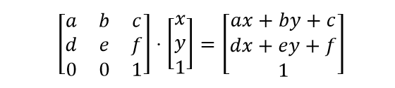

# MPI

[MPI Tutorial](<https://mpitutorial.com>)

```c
#include "stdafx.h"
#include "mpi.h"
#include <stdio.h>

using namespace std; 
int main()
{
  int num_tasks, rank;

  int rc = MPI_Init(NULL, NULL);
  if (rc != MPI_SUCCESS) {
    printf("Error starting MPI program. Terminating.\n");
    MPI_Abort(MPI_COMM_WORLD, rc);
  }
  MPI_Comm_size(MPI_COMM_WORLD, &num_tasks);
  MPI_Comm_rank(MPI_COMM_WORLD, &rank);

  printf("Greetings from Process: %d", rank);
  MPI_Finalize();
    return 0;
}
```

## Docs

### MPI_Address

Gets the address of a location in memory 

```c
int MPI_Address(const void *input_location, MPI_Aint *output_address)
```

> This is a depricated function. To be able to use it, add `_CRT_SECURE_NO_WARNINGS` and `MSMPI_NO_DEPRECATE_20` to preprocessor definitions [in this way](https://stackoverflow.com/questions/16883037/remove-secure-warnings-crt-secure-no-warnings-from-projects-by-default-in-vis)

### MPI_Send

```c
int MPI_Send(
      const void *buf, //initial address of send buffer (choice) 
      int count, 
      MPI_Datatype datatype, 
      int dest,        // rank of destination (integer) 
      int tag,         // message tag (integer) 
      MPI_Comm comm)   // communicator (handle) 
```

### MPI_Recv

```c
int MPI_Recv(
      void *buf, 
      int count, 
      MPI_Datatype datatype, 
      int source, 
      int tag, 
      MPI_Comm comm, 
      MPI_Status *status)
```

### MPI_Bcast

Broadcasts a message from the process with rank "root" to all other processes of the communicator. 

[How to use](https://stackoverflow.com/questions/7864075/using-mpi-bcast-for-mpi-communication)

```c
int MPI_Bcast(
      void *buffer,
      int count, 
      MPI_Datatype datatype, 
      int root, 
      MPI_Comm comm)
```

### MPI_Scatter

[Tutorial](https://mpitutorial.com/tutorials/mpi-scatter-gather-and-allgather/)


```c
int MPI_Scatter(
      const void *sendbuf, 
      int sendcount, 
      MPI_Datatype sendtype,
      void *recvbuf, 
      int recvcount, 
      MPI_Datatype recvtype, 
      int root,
      MPI_Comm comm)
```

- `sendbuf` address of send buffer (choice, significant only at root) 
- `sendcount` number of elements sent to each process (integer, significant only at root) 
- `sendtype` data type of send buffer elements (significant only at root) (handle) 
- `recvcount` number of elements in receive buffer (integer) 
- `recvtype` data type of receive buffer elements
- `root` rank of sending process (integer)

### MPI_Gather


```c
int MPI_Gather(
      const void *sendbuf,
      int sendcount,
      MPI_Datatype sendtype,
      void *recvbuf,
      int recvcount,
      MPI_Datatype recvtype,
      int root, 
      MPI_Comm comm)
```

- `sendbuf` starting address of send buffer (choice) 
- `sendcount` number of elements in send buffer (integer) 
- `sendtype` data type of send buffer elements (handle) 
- `recvcount` number of elements for any single receive (integer, significant only at root) 
- `recvtype` data type of recv buffer elements (significant only at root) (handle) 
- `root` rank of receiving process (integer) 
- `comm` communicator (handle) 

### MPI_type_struct

```c
int MPI_Type_struct(
      int count,
      const int *array_of_blocklengths,
      const MPI_Aint *array_of_displacements,
      const MPI_Datatype *array_of_types,
      MPI_Datatype *newtype)
```

- `count` number of blocks (integer) in datatype, also number of entries in arrays array_of_types, array_of_displacements and array_of_blocklengths 
- `array_of_blocklengths` number of elements in each block (array). *i-ti* član ovog niza je broj elemenata tipa `array_of_types[i]` u i-tom bloku.
- `array_of_displacements` byte displacement of each block (array). Niz pomeraja svakog bloka u odnosu na početnu adresu strukture, ali izražen u bajtovima. Dobija se uz pomoć funkcije `MPI_Address`
- `array_of_types` type of elements in each block (array of handles to datatype objects) 

Example:

```c
struct{char a, int b, double c} val;

MPI_Address(&val.a, &baseadr);  // array_of_types[0] is MPI_CHAR
MPI_Address(&val.b, &adr_b);    // array_of_types[1] is MPI_INT
MPI_Address(&val.c, &adr_c);    // array_of_types[2] is MPI_DOUBLE

array_of_displacements[0]=0 // pomeraj prvog bloka u odnosu na početak strukture
array_of_displacements[1]=adr_b-baseadr
array_of_displacements[2]=adr_c-baseadr
```

### MPI_Type_vector

Omogucava da formiramo izveden tip podatka gde su blokovi koji čine izveden tip iste veličine. Poceči blokova se nalaze na *jednakim rastojanjima*.

```c
int MPI_Type_vector(
      int count, 
      int block_len,
      int stride, //predstavlja razmak izmedju pocetaka blokova izrazen u elementima starog tipa (stari tip je sledeci argument funkcije),
      MPI_Type oldtype);
```

- `count` number of blocks (nonnegative integer) 
- `blocklength` number of elements in each block (nonnegative integer) 
- `stride` number of elements between start of each block (integer). Predstavlja razmak izmedju početaka blokova izražen u elementima starog tipa. Stari tip je sledeći tip funkcije.
- `oldtype` old datatype (handle) 

Example:

```c
// There are two blocks, each made of 3 blocks of old data type
count = 2, blocklen=3, stride=5, oldtype=MPI_Int;
```

| 1   |     |     |     |     | 2   |     |     |     |     |     |
| --- | --- | --- | --- | --- | --- | --- | --- | --- | --- | --- |
| x   | x   | x   | _   | _   | x   | x   | x   | _   | _   | _   |

Example: Send a column

```c
count = n, blocklen=1, stride = n, MPI_Int;

[x] x x
[x] x x
[x] x x n*n
```

### MPI_Type_indexed

```c
MPI_Type_indexed(
      int count, 
      int *array_of_blocklens,
      int *array_of_displacements, 
      MPI_Datatype oldtype,
      MPI_Datatype *newtype
);
```

- `count` number of blocks, also number of entries in *array_of_displacements* and *array_of_blocklengths*
- `array_of_blocklengths` number of elements in each block (array of nonnegative integers). Niz koji pamti veličinu svakog bloka, koja može biti različita
- `array_of_displacements` displacement of each block in multiples of oldtype (array of integers). Niz koji pamti pomeraje za svaki blok ali pomeraji su izrazeni u elementima starog tipa (u MPI_Typevector je izrazen u bajtovima)
- `oldtype` old datatype (handle) 

Example:

```c
count=3, 
blocklens[0]=2
blocklens[1]=1
blocklens[2]=4
displacements[0]=0
displacements[1]=3
displacements[2]=5
```

| 0   | 1   | 2   | 3   | 4   | 5   | 6   | 7   | 8   |
| --- | --- | --- | --- | --- | --- | --- | --- | --- |
| A   | A   | _   | B   | _   | C   | C   | C   | C   |

## 1. Zadatak

> Napisati MPI program kojim se izvedenim tipovima podataka vrši slanje kolone sa indeksom 1 procesa 0 matrice A, u vrstu sa indeksom 2 procesa 1. matrice A. Matrica A je reda *n*.

```
Matrix in process 0:
0       1       2       3
4       5       6       7
8       9       10      11
12      13      14      15
Matrix in process 1:
0       0       0       0
0       0       0       0
1       5       9       13
0       0       0       0
```

```c
#include "stdafx.h"
#include "mpi.h"
#include <stdio.h>
#include "C:\Users\i\Desktop\GitHub\CUDA\utilities.h"
#define n 4

using namespace std; 
void main(int argc, char *argv[]){
  int A[n][n], rank, i, j;
  MPI_Status st;
  MPI_Datatype kolona;

  MPI_Init(&argc, &argv);
  MPI_Comm_rank(MPI_COMM_WORLD, &rank);

  MPI_Type_vector(n, 1, n, MPI_INT, &kolona); // n blokova, velicine 1, udaljeni n blokova, tip podataka u matrici, novi tip podataka
  MPI_Type_commit(&kolona);

  if (rank == 0) {
    fill_array(&A[0][0], n*n, "2*i");
    printf("Matrix in process 0:\n");
    print_matrix(&A[0][0], n, n);
    // buf, count, MPI_Datatype, dest, tag, MPI_Comm
    MPI_Send(&(A[0][1]), 1, kolona, 1, 0, MPI_COMM_WORLD);
  }
  else {
    fill_array(&A[0][0], n*n, "0");
    // buf, count, MPI_Datatype, source, tag, MPI_Comm, MPI_Status)
    MPI_Recv(&A[2][0], n, MPI_INT, 0, 0, MPI_COMM_WORLD, &st);
    printf("Matrix in process 1:\n");
    print_matrix(&A[0][0], n, n);
  }
  MPI_Finalize();
}
```

Modification:

```
Matrix in process 0
0       1       2       3
4       5       6       7
8       9       10      11
12      13      14      15
Matrix in process 1
0       4       0       0
0       5       0       0
0       6       0       0
0       7       0       0
Press any key to continue . . .
...
MPI_Type_vector(n, 1, n, MPI_INT, &kolona);
MPI_Type_commit(&kolona);

MPI_Type_vector(n, 1, 1, MPI_INT, &red);
MPI_Type_commit(&red);
...
MPI_Send(&A[1][0], 1, red, 1, 0, MPI_COMM_WORLD);
MPI_Recv(&A[0][1], 1, kolona, 0, 0, MPI_COMM_WORLD, &st);
```

## 2. zadatak

> Napisati MPI program kojim se elementi gornje trougaone matrice procesa 0 salju i primaju u donju trougaonu matricu procesa 1.

```c
Process 0:
0       1       2       3
4       5       6       7
8       9       10      11
12      13      14      15
Process 1:
0       0       0       0
1       2       0       0
3       5       6       0
7       10      11      15
```

Gornji trougao:

```c
array_of_blocklens[0]=n     // n-1
array_of_blocklens[1]=n-1
array_of_blocklens[2]=n-2
array_of_blocklens[3]=n-3

array_of_displacements[0]=0 // (n+1)*i
array_of_displacements[1]=5
array_of_displacements[2]=10
array_of_displacements[3]=15
```

Donji trougao:

```c
array_of_blocklens[0]=1     // i+1
array_of_blocklens[1]=2
array_of_blocklens[2]=3
array_of_blocklens[3]=4

array_of_displacements[0]=0 // n*i
array_of_displacements[1]=4
array_of_displacements[2]=8
array_of_displacements[3]=12
```

```c
void main(int argc, char *argv[]){
  int A[n][n], rank, i, j;
  int array_of_blocklens[n], array_of_displacements[n];
  MPI_Status st;
  MPI_Datatype gornji_t, donji_t;
  MPI_Init(&argc, &argv);
  MPI_Comm_rank(MPI_COMM_WORLD, &rank);

  // Za gornji trougao
  for (int i = 0; i<n; i++) {
    array_of_blocklens[i] = n - i;
    array_of_displacements[i] = (n + 1)*i;
  }

  // count, *array_of_blocklens, *array_of_displacements, *old_data_type, *new_data_type
  MPI_Type_indexed(n, array_of_blocklens, array_of_displacements, MPI_INT, &gornji_t);
  MPI_Type_commit(&gornji_t); // Sada mozemo da koristimo gornji_t

  // Za donji trougao
  for (int i = 0; i< n; i++) {
    array_of_blocklens[i] = i + 1;
    array_of_displacements[i] = n*i;
  }

  MPI_Type_indexed(n, array_of_blocklens, array_of_displacements, MPI_INT, &donji_t);
  MPI_Type_commit(&donji_t);

  if (rank == 0) {
    fill_array(&A[0][0], n*n, "i");
    // buf, count, MPI_Datatype, dest, tag, MPI_Comm
    MPI_Send(&A[0][0], 1, gornji_t, 1, 0, MPI_COMM_WORLD);
    printf("Process 0:\n");
    print_matrix(&A[0][0], n, n);
  }
  else {
    fill_array(&A[0][0], n*n, "0");
    // buf, count, MPI_Datatype, source, tag, MPI_Comm, MPI_Status)
    MPI_Recv(&A[0][0], 1, donji_t, 0, 0, MPI_COMM_WORLD, &st);
    printf("Process 1:\n");
    print_matrix(&A[0][0], n, n);
  }
  MPI_Finalize();
}
```

## 3. Zadatak

> Napisati MPI program koji cita jedan podatak tipa `int` i jedan podatak tipa `double` sa standardnog ulaza u procesu `0`, a nakon toga koriscenjem izvedenih tipova podataka salje oba podatka istovremeno svim procesima. 

|     |     |     |     |     |     |     |     |     |     |     |     |     |     |     |     |
| --- | --- | --- | --- | --- | --- | --- | --- | --- | --- | --- | --- | --- | --- | --- | --- |
| A   | A   | A   | A   | _   | _   | _   | _   | B   | B   | B   | B   | B   | B   | B   | B   |

```c
using namespace std; 
void main(int argc, char *argv[]) {
  int rank;
  struct { int a=0; double b=0; } val;
  MPI_Datatype struktura, oldtypes[2];
  int blocklens[2];
  MPI_Aint dsp[2];
  MPI_Aint base_adr, adr1;

  MPI_Init(&argc, &argv);
  MPI_Comm_rank(MPI_COMM_WORLD, &rank);

  blocklens[0] = 1;
  oldtypes[0] = MPI_INT;
  blocklens[1] = 1;
  oldtypes[1] = MPI_DOUBLE;

  MPI_Address(&val.a, &base_adr);
  MPI_Address(&val.b, &adr1);
  dsp[0] = 0;
  dsp[1] = adr1 - base_adr;

  // count, *array_of_blocklengths, *array_of_displacements, *array_of_types, *newtype
  MPI_Type_struct(2, blocklens, dsp, oldtypes, &struktura); // 2 because of int and double
  MPI_Type_commit(&struktura);

  if (rank == 0) {
    scanf("%d %d", &val.a, &val.b);
  }

  printf("[%d]: Before Bcast, val.a=%d val.b=%d\n", rank, val.a, val.b);
  // everyone calls Bcast- data is taken from root and ends up in everyone's buf
  MPI_Bcast(&val, 1, struktura, 0, MPI_COMM_WORLD);
  printf("[%d]: After Bcast, val.a=%d val.b=%d\n\n", rank, val.a, val.b);
  MPI_Finalize();
}
```

Modification:

```c
using namespace std; 
void main(int argc, char *argv[]) {
  struct {
    int a = -1;
    double b = -1;
    float c[2] = { -1.5, -1.5 };  // array
  } val;
  const int DIFFERENT_DATATYPES = 3;

  int rank;
  MPI_Datatype nova_struktura, old_types[DIFFERENT_DATATYPES];
  MPI_Aint dsp[DIFFERENT_DATATYPES];
  int block_lens[DIFFERENT_DATATYPES];
  ...
  block_lens[0] = 1;
  block_lens[1] = 1;
  block_lens[2] = 2;  // 2 because of the array

  old_types[0] = MPI_INT;
  old_types[1] = MPI_DOUBLE;
  old_types[2] = MPI_FLOAT;

  MPI_Address(&val.a, &base_adr);
  MPI_Address(&val.b, &adr_b);
  MPI_Address(&val.c, &adr_c0);
  dsp[0] = 0;
  dsp[1] = adr_b - base_adr;
  dsp[2] = adr_c0 - base_adr;

  MPI_Type_struct(DIFFERENT_DATATYPES, block_lens, dsp, old_types, &nova_struktura);
  MPI_Type_commit(&nova_struktura);
  ...
```

---

## MPI 2. nedelja

*Slanje prvog izvedenog tipa: čim se pošalje zadnji bajt, odmah ide slanje sledećeg (počevši od jedan bajt posle kraja posledneg izvedenog tipa).*

Primer izvedenog tipa podatka:

```c
MPI_Type_vector(3,2,4,MPI_INT,&izvtip);
```

| 1   |     |     |     |     |     |     |     |     |     |     |     |
| --- | --- | --- | --- | --- | --- | --- | --- | --- | --- | --- | --- |
| x   | x   | _   | _   | x   | x   | _   | _   | x   | x   | _   | _   |

Bez praznih mesta (bajtova):

| 1   |     |     |     |     |     |     |     |     |     | 2   |     |     |     |     |     |     |     |     |     | 3   |     |     |     |     |     |     |     |     |     |
| --- | --- | --- | --- | --- | --- | --- | --- | --- | --- | --- | --- | --- | --- | --- | --- | --- | --- | --- | --- | --- | --- | --- | --- | --- | --- | --- | --- | --- | --- |
| x   | x   | _   | _   | x   | x   | _   | _   | x   | x   | x   | x   | _   | _   | x   | x   | _   | _   | x   | x   | x   | x   | _   | _   | x   | x   | _   | _   | x   | x   |

Ako hocemo sa praznim:

| 1   |     |     |     |     |     |     |     |     |     |     |     | 2   |     |     |     |     |     |     |     |     |     |     |     | 3   |     |     |     |     |     |     |     |     |     |     |     |
| --- | --- | --- | --- | --- | --- | --- | --- | --- | --- | --- | --- | --- | --- | --- | --- | --- | --- | --- | --- | --- | --- | --- | --- | --- | --- | --- | --- | --- | --- | --- | --- | --- | --- | --- | --- |
| x   | x   | _   | _   | x   | x   | _   | _   | x   | x   | _   | _   | x   | x   | _   | _   | x   | x   | _   | _   | x   | x   | _   | _   | x   | x   | _   | _   | x   | x   | _   | _   | x   | x   | _   | _   |

```c
MPI_Type_create_resized(MPI_Datatype it, 
  MPI_AInt lb,
  MPI_AInt extent, 
  MPI_Datatype *newtype
  )
```

- `lb` Nova donja granica tipa koja odgovara najmanjem displacement-u podatka u starom tipu. Obično je 0.
- `extent` (rastojanje) New extent of datatype (address integer). Utiče na to odakle će krenuti slanje svake sledeće jedinice novog tipa. Izrazen u bajtovima. Jednaka najmanjem displacement-u u tipu.
- `newtype` Output. Novi izvedeni Tip

`lb + extend = gornja granica`

```c
MPI_Type_vector(...);
MPI_Type_create_resized(izvtip, 0, 12 * sizeof(int));
MPI_Send(buff, 10 , izvtip, 1, 0, MPI_COMM_WORLD);
```

### Send a column to each process.

|         |     |     |     |
| ------- | --- | --- | --- |
| **a00** | a01 | a02 | a03 |
| **a10** | a11 | a12 | a13 |
| **a20** | a21 | a22 | a23 |
| **a30** | a31 | a32 | a33 |

```c
MPI_Type_vector(n,1,n,MPI_INT,&kolona);
MPI_Type_create_resized(kolona, 0, sizeof(int), &nkolona)
MPI_Scatter(&a[0][0], 1, kolona, ...);
```

### Send to each process n/p columns

`n=6, p=3`

| p0  | p0  | p1  | p1  | p2  | p2  |
| --- | --- | --- | --- | --- | --- |
| x   | x   | x   | x   | x   | x   |
| x   | x   | x   | x   | x   | x   |
| x   | x   | x   | x   | x   | x   |
| x   | x   | x   | x   | x   | x   |
| x   | x   | x   | x   | x   | x   |
| x   | x   | x   | x   | x   | x   |

```c
MPI_Type_vector(n, n/p, n, MPI_INT, &kolone)
MPI_Type_create_resized(kolone, 0, (n/p)*sizeof(int), &nkolona);
MPI_Scatter(&A[0][0], 1, nkolona...);
```

## Zadatak 1

> Napisati MPI program koji realizuje množenje matrice *A*, n*n, i vektora *Bn*, čime se dobija rezultujući vektor *Cn*. Matrica *A* i vektor *Bn* se inicijalizuju u master procesu. Matrica *A* je podeljena u blokove po vrstama i to tako da proces *Pi* dobija vrste sa indeksima *L*, gde je `L mod p=i (0<=i<=p-1)` tj. vrste sa indeksima `i, i+p, i+2p,..., i+n-p`. Master proces distribuira blokove matrice *A* i ceo vektor *B* svim procesima. Slanje svakog bloka matrice *A* se obavlja odjednom. Svaki proces učestvuje u izračunavanju rezultata koji se prikazuje u master procesu.

```
A:
0       1       2       3       4       5
6       7       8       9       10      11
12      13      14      15      16      17
18      19      20      21      22      23
24      25      26      27      28      29
30      31      32      33      34      35

B:
0 2 4 6 8 10

local_C: 110 290 470 650 830 1010
```



*broj procesa p=3, n=6:*

*P=0 dobija L=0 i L=3 vrstu* `0 mod 3 = 0; 3 mod 3 = 0` tj. `0, 0+3`

*P=1 dobija L=1 i L=4 vrstu* `1 mod 3 = 1; 4 mod 3 = 1` tj. `1, 1+3`

*P=2 dobija L=2 i L=5 vrstu* `2 mod 3 = 2; 5 mod 3 = 2` tj. `2, 2+3`

*An\*n*

| i   | P      |     |     |     |     |     |     |
| --- | ------ | --- | --- | --- | --- | --- | --- |
| 0   | **P0** | x   | x   | x   | x   | x   | x   |
| 1   | P1     | x   | x   | x   | x   | x   | x   |
| 2   | *P2*   | x   | x   | x   | x   | x   | x   |
| 3   | **P0** | x   | x   | x   | x   | x   | x   |
| 4   | P1     | x   | x   | x   | x   | x   | x   |
| 5   | *P2*   | x   | x   | x   | x   | x   | x   |

`*`

| vektor *Bn* |
| ----------- |
| x           |
| x           |
| x           |
| x           |
| x           |

`=`

| vektor *Cn* |
| ----------- |
| x           |
| x           |
| x           |
| x           |
| x           |

```c
MPI_Type_vector(n/p, n, p*n, MPI_INT, &vrste)  // 1 new datatype has two whole rows
MPI_Type_create_resize(&vrste, 0, n*sizeof(int), &nvrste)
```

```c
void main(int argc, char * argv[]) {
  int A[n][n], B[n], C[n], rank, i, j;
  MPI_Datatype rows, separated_rows, new_type, fixed_new_type;
  MPI_Init(&argc, &argv);
  MPI_Comm_rank(MPI_COMM_WORLD, &rank);
  //MPI_Comm_size(MPI_COMM_WORLD, &p);
  int * local_A = (int*)malloc((n / p) * n * sizeof(int));
  int * local_C = (int*)malloc((n / p) * sizeof(int));

  MPI_Type_vector(n / p, n, p*n, MPI_INT, &rows);
  MPI_Type_create_resized(rows, 0, n * sizeof(int), &separated_rows);
  MPI_Type_commit(&separated_rows);

  if (rank == 0) {
    printf("A:\n");
    fill_array(&A[0][0], n*n, "i", rank);
    print_matrix(&A[0][0], n, n);

    printf("\nB:\n");
    fill_array(&B[0], n, "2*i");
    print_array(&B[0], n);
    printf("\n");
  }

  // MPI_Scatter(send_buffer, send_count, send_type, recv_buffer, recv_count, recv_type, rank, comm ) 
  MPI_Scatter(&A[0][0], 1, separated_rows, local_A, (n / p) * n, MPI_INT, 0, MPI_COMM_WORLD);
  // MPI_Bcast(buffer, count, datatype, rank, comm)
  MPI_Bcast(B, n, MPI_INT, 0, MPI_COMM_WORLD);

  for (int i = 0; i < n / p; i++) { // 0 and 1, for n=6 and p=3
    local_C[i] = 0;
    for (int j = 0; j < n; j++) { // 0..5
      local_C[i] += local_A[i*n + j] * B[j];
      // if (rank == 0) { printf("rank=%d i=%d %d*%d\n", rank, i, local_A[i*n + j], B[j]);}
      /*      p0  p1  p2        p0  p1  p2
      local_c[0]  x   x   x  local_c[1]  x   x   x
      */
    }
  }

  // printf(">> rank=%d:\n\tlocal_A[0]=%d local_A[1]=%d\n\tlocal_A[n]=%d local_A[n+1]=%d\n\tlocal_C[0]=%d local_C[1]=%d\n", rank, local_A[0], local_A[1], local_A[n], local_A[n+1], local_C[0], local_C[1]);

  // Error! This way it would be 110 650 290 830 470 1010
  // MPI_Gather(send_buffer, send_count, send_type, recv_buffer, recv_count, recv_type, rank, comm)
  // MPI_Gather(local_C, n / p, MPI_INT, C, 2, MPI_INT, 0, MPI_COMM_WORLD); [12:30]

  // MPI_Type_vector(count, blocklength, stride, oldtype, newtype)
  MPI_Type_vector(n/p, 1, p, MPI_INT, &new_type); // [14:50]  [1][ ][ ][1]
  // MPI_Type_create_resized(oldtype, lb, extent, newtype)  
  MPI_Type_create_resized(new_type, 0, sizeof(int), &fixed_new_type);  // [15:50] [1][2][3][1][2][3]
  MPI_Type_commit(&fixed_new_type);

  // MPI_Gather(send_buffer, send_count, send_type, recv_buffer, recv_count, recv_type, rank, comm)
  MPI_Gather(local_C, n/p, MPI_INT, C, 1, fixed_new_type, 0, MPI_COMM_WORLD);

  if (rank == 0) {
    printf("local_C: ");
    print_array(&C[0], n);
  }
  MPI_Finalize();
}
```

## Zadatak 2

> Napisati MPI program koji realizuje množenje matrica *An\*n* i *Bn\*n* čime se dobija rezultujuca matrica *Cn\*n*. Množenje se obavlja tako sto master proces inicijalizuje matrice *A* i *B* i šalje svakom procesu po jednu kolonu matrice *A* i jednu vrstu *B*. Svi procesi učestvuju u izračunavanju a rezultat se nalazi i prikazuje u procesu sa rankom 0.

```
A:
1       2       3
4       5       6
7       8       9

B:
1       3       5
7       9       11
13      15      17

C:
54      66      78
117     147     177
180     228     276

vvvvvvvvvvvvvvvv
rank=0
        [1]
        [4]
        [7]

*       [1 3 5]

=       [1 3 5]
        [4 12 20]
        [7 21 35]
^^^^^^^^^^^^^^^^
vvvvvvvvvvvvvvvv
rank=1
        [2]
        [5]
        [8]

*       [7 9 11]

=       [14 18 22]
        [35 45 55]
        [56 72 88]
^^^^^^^^^^^^^^^^
vvvvvvvvvvvvvvvv
rank=2
        [3]
        [6]
        [9]

*       [13 15 17]

=       [39  45   d51]
        [78  90  102]
        [117 135 153]
^^^^^^^^^^^^^^^^
```

|         |     |
| ------- | --- |
| p0      | p1  |
| **a00** | a01 |
| **a10** | a11 |

`*`

|     |         |         |
| --- | ------- | ------- |
| p0  | **b00** | **b01** |
| p1  | b10     | b11     |

`=`

|     |     |
| --- | --- |
| c00 | c01 |
| c10 | c11 |

```
a00*b00 + a01*b10   a00*b01 + a01*b11
a10*b00 + a11*b10   a10*b01 + a11*b11
```

```c
void main(int argc, char * argv[]) {
  int A[n][n], B[n][n], C[n][n], tmp[n][n], one_row[n], one_col[n];
  int rank, i, j;
  MPI_Datatype col, succesive_col;
  MPI_Init(&argc, &argv);
  MPI_Comm_rank(MPI_COMM_WORLD, &rank);

  if (rank == 0) {
    fill_array(&A[0][0], n*n, "i", 0, 1);
    fill_array(&B[0][0], n*n, "2*i", 0, 1);
    printf("A:\n");
    print_matrix(&A[0][0], n, n);
    printf("\nB:\n");
    print_matrix(&B[0][0], n, n);
  }

  MPI_Type_vector(n, 1, n, MPI_INT, &col);
  MPI_Type_create_resized(col, 0, sizeof(int), &succesive_col);
  MPI_Type_commit(&succesive_col);
  MPI_Scatter(&A[0][0], 1, succesive_col, one_col, n, MPI_INT, 0, MPI_COMM_WORLD);
  MPI_Scatter(&B[0][0], n, MPI_INT, one_row, n, MPI_INT, 0, MPI_COMM_WORLD);

  for (i = 0; i<n; i++) {
    for (j = 0; j<n; j++) {
      tmp[i][j] = one_col[i] * one_row[j];
    }
  }
  // MPI_Reduce (send_buffer, recv_buffer, count, datatype, operation, rank, comm)
  MPI_Reduce(&tmp[0][0], &C[0][0], n*n, MPI_INT, MPI_SUM, 0, MPI_COMM_WORLD);
  if (rank == 0) {
    printf("\nC:\n");
    print_matrix(&C[0][0], n, n);
  }
  MPI_Finalize();
}
```

---

## MPI 3. nedelja

### Grupe i komunikatori

[Tutorial](https://mpitutorial.com/tutorials/introduction-to-groups-and-communicators/)

```c
MPI_Comm_group(
  MPI_Comm comm,
  MPI_Group* group)
```

Kao argument uzima komunikator i vraća odgovarajuću grupu procesa. Ova funkcija je važna za kasnije formiranje novih grupa od osnovne grupe.

---

```c
MPI_Group_rank(
  MPI_Group group,
  int *rank)
```

Vraća identifikator procesa unutar grupe.

---

```c
MPI_Group_size(
  MPI_Group group,
  int *size)
```

Vraća broj procesa unutar grupe.

---

```c
MPI_Group_excl(
  MPI_Group group,
  int count, 
  int *nonmembers,
  MPI_Group *new_group)
```

Vraća novu grupu tako što se iz stare grupe isključe procesi sa identifikatorima koji su definisani sa `nonmembers`, i kojih ima `count`. Redosled procesa u novoj grupi prati redosled procesa u staroj grupi.

---

```c
MPI_Group_incl(
  MPI_Group old_group,
  int n,
  const int ranks[],
  MPI_Group* newgroup)
```

- `group` group (handle) 
- `n` number of elements in array ranks (and size of `newgroup`)(integer) 
- `ranks` ranks of processes in group to appear in `newgroup` (array of integers).

Vraća novu grupu tako što procesi sa identifikatorima iz stare grupe koji su definisani sa `ranks` čine novu grupu. Procesa u novoj grupi ima `count`. Proces *members[i]* u novoj grupi ima rang *i*.

---

```c
MPI_Group_intersection(
  MPI_Group group1,
  MPI_Group group2,
  MPI_Group *newgroup)
```

Vraća novu grupu koja se sastoji od procesa preseka grupa `group1` i `group2`, s tim što je redosled procesa u novoj grupi kao u prvoj grupi

---


```c
MPI_Group_union(
  MPI_Group group1,
  MPI_Group group2,
  MPI_Group* newgroup)
```

Vraća novu grupu koja se sastoji od procesa grupe `group1` na koju se nadovezuju elementi `group2` koji nisu `group1`

---

```c
MPI_Group_difference(
  MPI_Group group1,
  MPI_Group group2,
  MPI_Group *newgroup)
```

Vraća novu grupu koja se sastoji od procesa grupe `group1` koji nisu `group2` uređene kao u `group1`.

---

```c
MPI_Comm_create(
  MPI_Comm old_comm,
  MPI_Group group,
  MPI_Comm* newcomm)
```

- `comm` communicator (handle) 
- `group` group, which is a subset of the group of comm (handle) 

Kreira novi komunikator `new_comm` od procesa iz grupe group koja kreirana iz `old_comm`.

The key difference however (besides the lack of the tag argument), is that `MPI_Comm_create_group` is only collective over the group of processes contained in group, where `MPI_Comm_create` is collective over every process in `comm`.

---


```c
MPI_Comm_split(
  MPI_Comm old_comm,
  int color,
  int key,
  MPI_Comm* newcomm)
```

- `comm` communicator (handle) 
- `color` control of subset assignment (nonnegative integer or `MPI_UNDEFINED`). Processes with the same color are in the same new communicator.
- `key` control of rank assignment (integer) 

Razbija komunikator `old_comm` na više delova tako sto svi procesi koji imaju istu vrednost za `color` pripadaju istom podkomunikatoru. `Key` određuje redosled procesa u podkomunikatorima. Ako je `key` isti za sve procese onda se redosled procesa preuzima iz starog komunikatora

---

`MPI_Comm_free(MPI_Comm *comm)`

MPI has a limited number of objects that it can create at a time and not freeing your objects could result in a runtime error if MPI runs out of allocatable objects.

---

```c
void main(int argc, char * argv[]) {
  MPI_Init(&argc, &argv);

  int world_rank, world_size;
  MPI_Comm_rank(MPI_COMM_WORLD, &world_rank);
  MPI_Comm_size(MPI_COMM_WORLD, &world_size);

  int color = world_rank / 4; // Determine color based on row

  // Split the communicator based on the color and use the original rank for ordering
  MPI_Comm row_comm;
  MPI_Comm_split(MPI_COMM_WORLD, color, world_rank, &row_comm);

  int row_rank, row_size;
  MPI_Comm_rank(row_comm, &row_rank);
  MPI_Comm_size(row_comm, &row_size);

  printf("WORLD RANK/SIZE: %d/%d \t ROW RANK/SIZE: %d/%d\n", world_rank, world_size, row_rank, row_size); 
  MPI_Comm_free(&row_comm);
  MPI_Finalize();
}
```

---

### Zadatak 1

> Napisati MPI program kojim se vrši podela procesa članova komunikatora MPI_COMM_WORLD u dve grupe: grupu procesa sa neparnim identifikatorima i grupu procesa sa parnim identifikatorima.

`#define p 7`

```c
rank=0 rank_u_parnoj_grupi=0      rank_u_neparnoj_grupi=-32766
rank=1 rank_u_parnoj_grupi=-32766 rank_u_neparnoj_grupi=0
rank=2 rank_u_parnoj_grupi=1      rank_u_neparnoj_grupi=-32766
rank=3 rank_u_parnoj_grupi=-32766 rank_u_neparnoj_grupi=1
rank=4 rank_u_parnoj_grupi=2      rank_u_neparnoj_grupi=-32766
rank=5 rank_u_parnoj_grupi=-32766 rank_u_neparnoj_grupi=2
rank=6 rank_u_parnoj_grupi=3      rank_u_neparnoj_grupi=-32766
```

```c
MPI_Group group_world, grupa_neparnih, grupa_parnih;
int i, num_p, br_parni, members[8], rank_u_parnoj_grupi, rank_u_neparnoj_grupi, rank;
MPI_Init(&argc, &argv);
MPI_Comm_size(MPI_COMM_WORLD, &num_p);
MPI_Comm_rank(MPI_COMM_WORLD, &rank);
MPI_Comm_group(MPI_COMM_WORLD, &group_world);
br_parni = (num_p + 1) / 2;
for (i = 0; i<br_parni; i++) {
  members[i] = 2 * i;
};

MPI_Group_incl(group_world, br_parni, members, &grupa_parnih);
// ^ Vraća novu grupu tako što procesi sa identifikatorima iz stare grupe koji su definisani sa `ranks` čine novu grupu

MPI_Group_excl(group_world, br_parni, members, &grupa_neparnih);
// ^ Vraća novu grupu tako što se iz stare grupe isključe procesi sa identifikatorima koji su definisani sa `nonmembers`, i kojih ima `count`.

MPI_Group_rank(grupa_parnih, &rank_u_parnoj_grupi);
MPI_Group_rank(grupa_neparnih, &rank_u_neparnoj_grupi);

printf("rank=%d rank_u_parnoj_grupi=%d rank_u_neparnoj_grupi=%d\n", rank, rank_u_parnoj_grupi, rank_u_neparnoj_grupi);

MPI_Finalize();
```

Drugi način:

```c
rank=0 key=7 new_rank=0 color=0 new_size=4
rank=1 key=7 new_rank=0 color=1 new_size=3
rank=2 key=7 new_rank=1 color=0 new_size=4
rank=3 key=7 new_rank=1 color=1 new_size=3
rank=4 key=7 new_rank=2 color=0 new_size=4
rank=5 key=7 new_rank=2 color=1 new_size=3
rank=6 key=7 new_rank=3 color=0 new_size=4
```

```c
int i, color, rank, new_rank, new_size, key;
MPI_Comm new_comm;
MPI_Init(&argc, &argv);
MPI_Comm_rank(MPI_COMM_WORLD, &rank);
color = rank % 2;
key = 7;
MPI_Comm_split(MPI_COMM_WORLD, color, key, &new_comm);
MPI_Comm_size(new_comm, &new_size);
MPI_Comm_rank(new_comm, &new_rank);
printf("rank=%d key=%d new_rank=%d color=%d new_size=%d\n", rank, key, new_rank, color, new_size);
MPI_Finalize();
```

### Zadatak 2

`#define p 6` 

```c
current_rank=0 row_id=0 col_id=0 rank_in_row=0 rank_in_col=0
current_rank=1 row_id=0 col_id=1 rank_in_row=1 rank_in_col=0
current_rank=2 row_id=1 col_id=0 rank_in_row=0 rank_in_col=1
current_rank=3 row_id=1 col_id=1 rank_in_row=1 rank_in_col=1
current_rank=4 row_id=2 col_id=0 rank_in_row=0 rank_in_col=2
current_rank=5 row_id=2 col_id=1 rank_in_row=1 rank_in_col=2
```

```c
int row_id, col_id;
int const COLUMNS = 2;
MPI_Comm row_comm, col_comm;
int global_rank, rank_in_row, rank_in_col;
MPI_Init(&argc, &argv);
MPI_Comm_rank(MPI_COMM_WORLD, &global_rank);
row_id = global_rank / COLUMNS; /* 001122 */
col_id = global_rank % COLUMNS; /* 010101 */
MPI_Comm_split(MPI_COMM_WORLD, row_id, col_id, &row_comm);
MPI_Comm_split(MPI_COMM_WORLD, col_id, row_id, &col_comm);

MPI_Comm_rank(row_comm, &rank_in_row);
MPI_Comm_rank(col_comm, &rank_in_col);

printf("current_rank=%d row_id=%d col_id=%d rank_in_row=%d rank_in_col=%d", current_rank, row_id, col_id, rank_in_row, rank_in_col);
MPI_Finalize();
```

### Zadatak 3

> Napisati MPI program koji realizuje množenje matrica A i B reda n, čime se dobija rezultujuća matrica C=A*B. Množenje se obavlja tako što master proces (sa identifikatorom 0) šalje svakom procesu radniku jednu kolonu matrice A i jednu vrstu matrice B. Master proces ne učestvuje u izračunavanju. Štampati dobijenu matricu.

```c
#define p 4 // number of processes
#define n 3 // !!! Matrix is n*n, not p*p, because one process doesn't calculate
#define TAG 32
using namespace std; 

void main(int argc, char * argv[]) {
  int rank, worker_rank;
  int A[n][n], B[n][n], tmp[n][n], C[n][n];
  int one_row[n], one_col[n];
  int const ROOT = 0;
  int ranks[] = { ROOT };  // Exclude process 0
  int i, j;
  MPI_Status status;
  MPI_Datatype col;
  MPI_Group workers_group, world_group;
  MPI_Comm workers_comm;

  MPI_Init(&argc, &argv);
  MPI_Comm_rank(MPI_COMM_WORLD, &rank);

  MPI_Type_vector(n, 1, n, MPI_INT, &col);
  MPI_Type_commit(&col);

  MPI_Comm_group(MPI_COMM_WORLD, &world_group);
  MPI_Group_excl(world_group, 1, ranks, &workers_group);  // Exclude proces 0 which only creates and sends the matrices and prints the result
  MPI_Comm_create(MPI_COMM_WORLD, workers_group, &workers_comm);
  MPI_Group_rank(workers_group, &worker_rank);

  if (rank == ROOT)
  {
    fill_array(&A[0][0], n*n, "i");
    fill_array(&B[0][0], n*n, "2*i");

    printf("\nA:\n");
    print_matrix(&A[0][0], n, n);

    printf("\nB:\n");
    print_matrix(&B[0][0], n, n);
    for (i = 0; i < n; i++)
    {
      MPI_Send(&A[0][i], 1, col, i + 1, TAG + 1, MPI_COMM_WORLD); //svakom procesu odgovarajucu kolonu
      MPI_Send(&B[i][0], n, MPI_INT, i + 1, TAG, MPI_COMM_WORLD); //svakom procesu odgovarajucu vrstu
    }
  }
  else
  {
    MPI_Recv(&one_col[0], n, MPI_INT, ROOT, TAG, MPI_COMM_WORLD, &status);
    MPI_Recv(&one_row[0], n, MPI_INT, ROOT, TAG + 1, MPI_COMM_WORLD, &status);
    for (int y = 0; y<n; y++)
    {
      for (int x = 0; x < n; x++)
        tmp[y][x] = one_row[y] * one_col[x];
        //tmp[x][y] = one_col[y] * one_row[x];
    }
    //printf("rank=%d\n", rank);
    //print_matrix(&tmp[0][0], n, n);
    MPI_Reduce(&tmp, &C, n*n, MPI_INT, MPI_SUM, ROOT, workers_comm);
  }
  if (worker_rank == 0)
  {
    printf("\nC:\n");
    print_matrix(&C[0][0], n, n);
  }
  MPI_Finalize();
}
```
